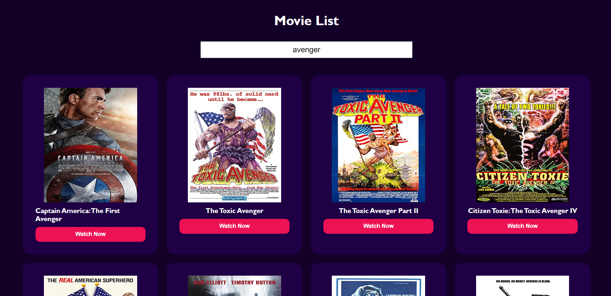

# Movie Search Web App

## Overview

The [Movie Search Web App](https://movie-search-website-js.netlify.app/) is a simple and user-friendly application that allows users to search for movies using an input box. Upon receiving the user's input, the application fetches movie data from the OMDB API based on the specific query and displays the relevant movie details such as movie title, poster image, genre, and plot.

## Features

- User-friendly interface with an input box for movie search.
- Real-time fetching of movie data from the OMDB API.
- Display of movie details, including movie title, poster image.
- Graceful handling of edge cases, such as when a movie is not found or the user provides invalid input.

## Technologies Used

- HTML
- CSS
- JavaScript

## Dependencies

- OMDB API