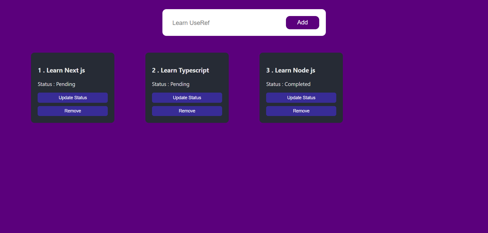

# Simple Todo Web App

## Overview

The [Todo Web App](https://simple-todo-app-react-js.netlify.app/) is a basic web application built with React that allows users to manage their todo list. Users can add new tasks, update their status, and remove tasks from the list.

## Features
- Add new tasks to the todo list.
- Update the status of tasks from "pending" to "completed" and vice versa.
- Remove tasks from the todo list.

## Technologies Used
- React: Front-end JavaScript library for building user interfaces.
- useState: React hook for managing state within functional components.